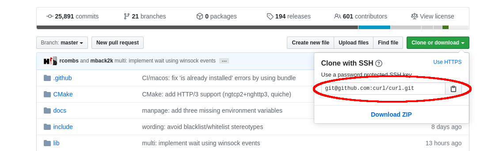

# Computing Stats for a Repo

Run in a local repo, get stats about dev behavior like code churn and PRs.

The idea is to compute some high-level dev engagement and behavior stats to get
an idea of how development works in this repo. The stats look at commit
lifecycle, including code churn and pull request cycle time.

# How to Run

## Running

The tool runs inside the git repository you want to analyze. It needs the
`GITHUB_TOKEN` environment variable set a GitHub token (see below). The tool
will automatically detect the GitHub repository name from the git remote called
"origin". See below under "Advanced Options" if your github repo is not in a
remote called "origin". It would be helpful to have your git repo as up-to-date
with the remote tracking your default branch as possible.

All you have to do is run the script with that environment
variable set, like so:

```
cd /path/to/my/repo/clone
GITHUB_TOKEN="my_github_token_here" /path/to/autodevstats/statstool
```

It can take some time (15-30 minutes) to process all
your commits and fetch all your data from GitHub. Once complete, the script
will output something like:

```
Thank You! Please email back the file /tmp/autodevstats.repo_name.wknJM1DgVg/stats.json
```

That `stats.json` file contians the resulting stats about your dev process.
Once you've returned that file back to AutoDev folks, it's safe to delete that
folder.

## Dependencies

The tool has a few dependencies:

* curl
* git
* gawk
* gnu coreutils
* pv
* ag
* jq

on a debian based linux distro, you can install these with:

```
sudo apt-get install curl git gawk coreutils pv silversearcher-ag jq
```

on mac os:

Install the dependencies and then update your path to put the standard gnu
coreutils tools on your path.

```
brew install the_silver_searcher coreutils curl git pv gawk
export PATH="$(brew --prefix coreutils)/libexec/gnubin:$PATH"
```

The tool will check for dependencies as the first thing it does. You should see
output like below if everything is ok. If not, it'll exit at the first check
that fails.

```
checking for dependencies...
checking for curl...
curl 7.58.0 (x86_64-pc-linux-gnu) libcurl/7.58.0 OpenSSL/1.1.1 zlib/1.2.11 libidn2/2.0.4 libpsl/0.19.1 (+libidn2/2.0.4) nghttp2/1.30.0 librtmp/2.3
checking for git...
git version 2.26.2
checking for awk...
GNU Awk 4.1.4, API: 1.1 (GNU MPFR 4.0.1, GNU MP 6.1.2)
checking for join...
join (GNU coreutils) 8.28
checking for pv...
pv 1.6.6 - Copyright 2015 Andrew Wood <andrew.wood@ivarch.com>
checking for ag...
ag version 2.1.0
dependencies look good
```

## GitHub API Token

The tool will pull some data down from GitHub (pull requests, issues, comments,
etc.) in an effort to capture your development process. In order to access the
GitHub API, it needs an access token. You can create a token by following the
steps described in [the GitHub documentation](https://help.github.com/en/github/authenticating-to-github/creating-a-personal-access-token-for-the-command-line).

The token needs the top-level `repos` scope to fetch private repository data.
This is what the tutorial in the documentation walks you through granting, so
just follow that tutorial.

## Advanced Options

Other than setting `GITHUB_TOKEN`, as described above, as long as the tool runs
somewhere inside a clone of the repo you want to analyze, you don't need to
provide anything else. But there are other options you can specify to override
default, automated behavior.

The tool assumes your main github repo, the one you collaborate on with others,
that hosts your code reviews, is a git remote called "origin". From there, the
tool will automatically detect your default branch. And the tool will assume
that the default branch is tracked by that remote. If this is not the case
there are a couple of environment variables you can set to override this
behavior.

### URL of Origin

`ORIGIN_URL` can be set to the clone url for whatever github repository hosts
your main repository. You can grab this from github like so:



### Default Branch

`DEFAULT_BRANCH` the tool will try to get the default branch from your
repository's GitHub settings. You can override this by setting this environment
variable.

# FAQ

**What data are you looking at?**

We're trying to understand your dev process, so we're looking at your source
code, how it changes over time and your code review process. Specifically we're
looking at:

* commit history on your default branch, especially merge commits (`git log; git show`)
* commit messages and author (`git log`)
* GitHub repository information (`https://api.github.com/repos/:owner/:repo`)
* GitHub language information (`https://api.github.com/repos/:owner/:repo/languages`)
* GitHub pull requests (`https://api.github.com/repos/:owner/:repo/pulls`)
* GitHub PR comments (`https://api.github.com/repos/:owner/:repo/pulls/comments`)
* GitHub PR commits (`https://api.github.com/repos/:owner/:repo/pulls/:pull_number/commits`)
* GitHub issues (`https://api.github.com/repos/:owner/:repo/issues`)
* GitHub issue comments (`https://api.github.com/repos/:owner/:repo/issues/comments`)
* GitHub commit comments (`https://api.github.com/repos/:owner/:repo/comments`)
* GitHub commit pulls (`https://api.github.com/repos/:owner/:repo/commits/:sha/pulls`)

Although the tool looks at all of this data, we're going to compute high-level
summary stats that describe your dev process. The stats we ask for you to
return to us doesn't include this raw data.

**What stats are you computing?**

We're only interested in high-level aggregate and descriptive statistics about
your dev process and how developer engagement relates to different aspects of
that process. To do that we look at:

* The number of bytes of code in each langauges (as per GitHub languages API)
* Primary language used in the repository
* The number of open/closed issues
* The number of open/closed/merged pull requests
* How long pull requests last from open to close/merge
* How those numbers above have changed over time
* The number of comments PRs receive
* The size of PRs in terms of lines added/removed
* How the number of comments varies with size of PR
* How many GitHub PR merge commits are made to the default branch vs all commits
* How often [autolinks](https://help.github.com/en/github/writing-on-github/autolinked-references-and-urls) are used in commit messages, issues, and pull requests and whether they link to PRs or issues.
* The number of devs that comment on a PR
* The number of comments per dev in a PR and overall
* The number of review cycles per PR
* How long each review cycles is
* How long ago code was added to the repo
* How long code lasts from addition to removal
* How code lifetime varies with having a PR and with the number of PR comments
* How commits are distributed across developers
* How often commit messages indicating reviewed code agrees with GitHub PR merges
* How large un/reviewed commits are
* How many lines from un/reviewed commits are live/dead
* How old reviewed and unreviewed code is
* The overlap between files in code reviews vs files modified without review
* How often commits referenced in PR comments exist in default branch
* How often commits referenced in PR comments exist in the PR commit list
* How often commits in a PR are in the default branch
* The number of commits per PR
* The age of commits relative to PR creation
* Is the repository private?
* Is the repository a fork?
* The number of forks of the repository
* The number of stargazers
* the number of watchers

We do collect a few pieces of identifying information:
* repository name
* name of the default branch
* when the repository was created, updated and last pushed to

We don't collect any other identifiable information (like file names, folder
names, developer names, commit id, individual lines of code, etc.)

